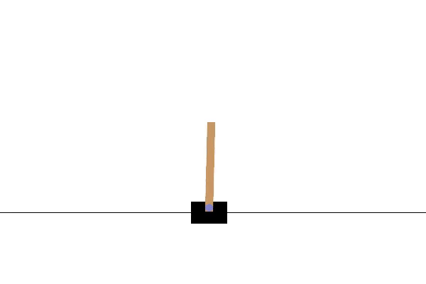
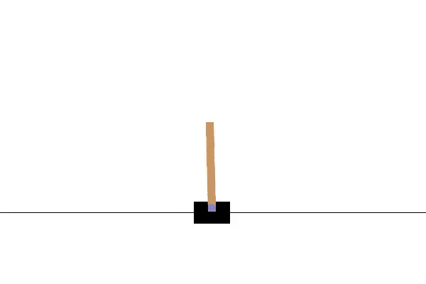
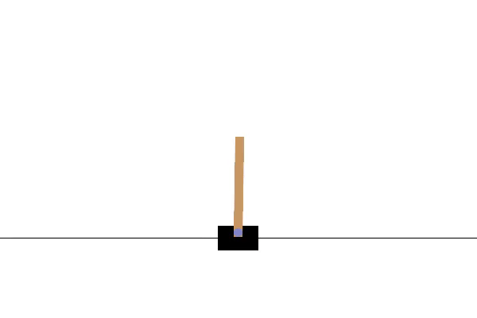

# **DQNKit** - A Collection of Deep Q Learning Algorithms

A collection of implementations of Deep Q variations, designed for "plug and play" modularity.

## Overview

This project provides a framework for training and testing Deep RL agents in various Gymnasium environments. 

**Other Features:**
*   Wrappers for common Gymnasium environments
*   TensorBoard logging
*   Checkpoint saving and loading.

## Usage

The main script for interacting with the whole project is `main.py`.
Set `TRAIN` to true after tuning hyperparameters to start your run.

This file also has a sample of hyperparams for a basic training run and demo

## demo

Episode 0 Episode 500	Episode 1000

	

	

| Episode 100 (Start)                      | Episode 500                            | Episode 1000 (End)                       |
| :------------------------------------: | :------------------------------------: | :--------------------------------------: |
|  |  |  |
| *Agent explores randomly*               | *Agent starts balancing effectively*    | *Agent balances consistently*             |

## Implemented Algorithms

* Standard DQN
    - The original DQN implementation first published [here](https://storage.googleapis.com/deepmind-media/dqn/DQNNaturePaper.pdf)
* Double Q learning
    - [original](https://arxiv.org/pdf/1509.06461)
* Dueling Architecture
    - you can choose between classic architecture and dueling for all algorithms
    - [original](https://arxiv.org/abs/1511.06581)
* Prioritized experience replay
    - you can also choose to enable this or not for all algorithms
    - [original](https://arxiv.org/abs/1511.05952)
